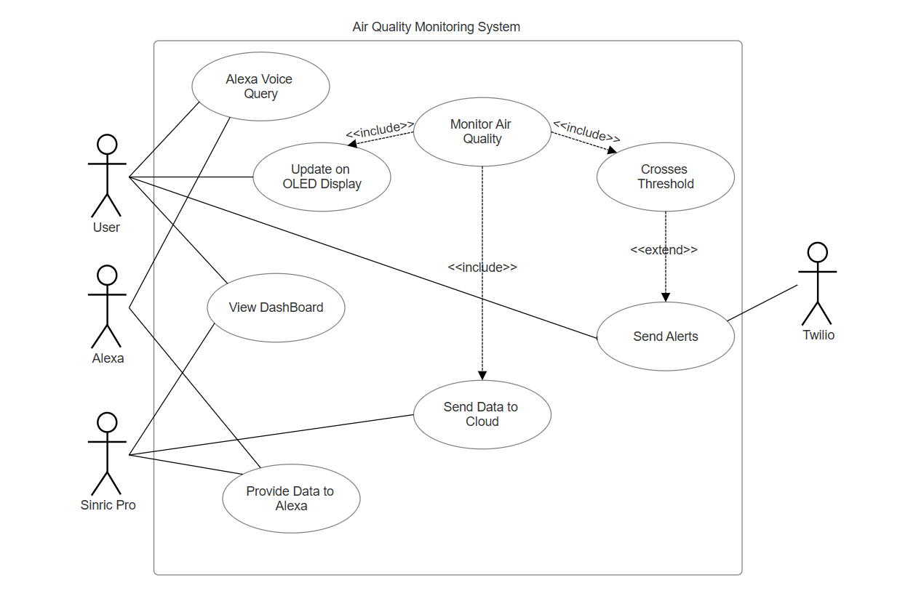
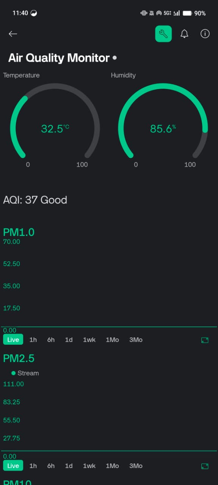
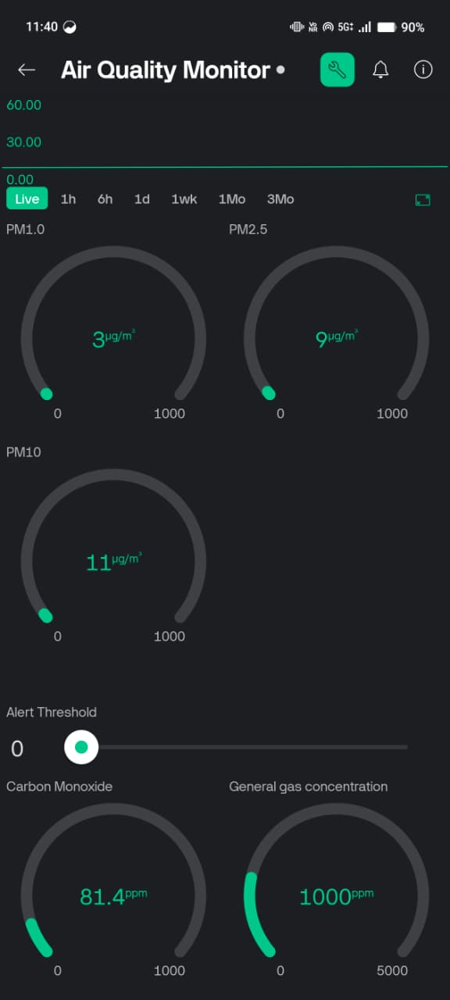
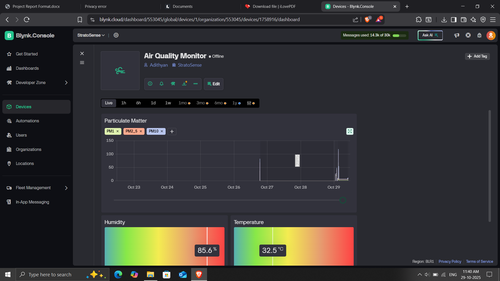
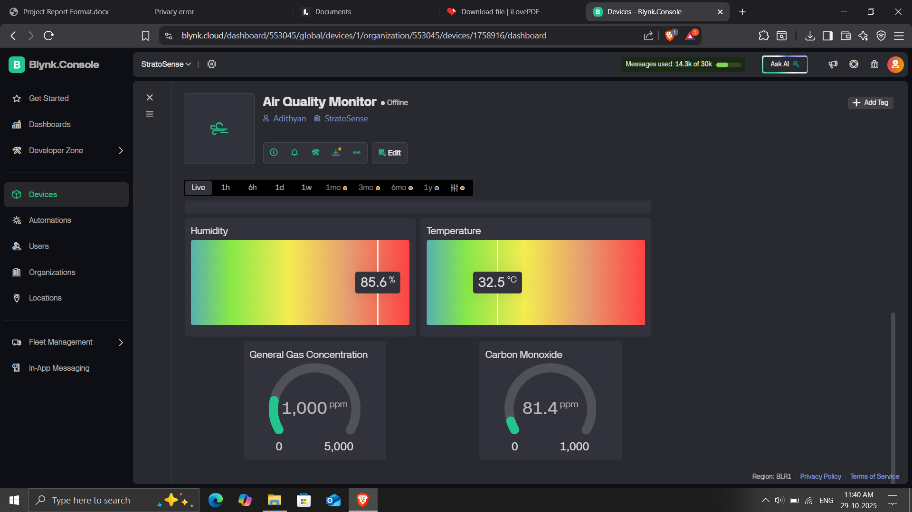
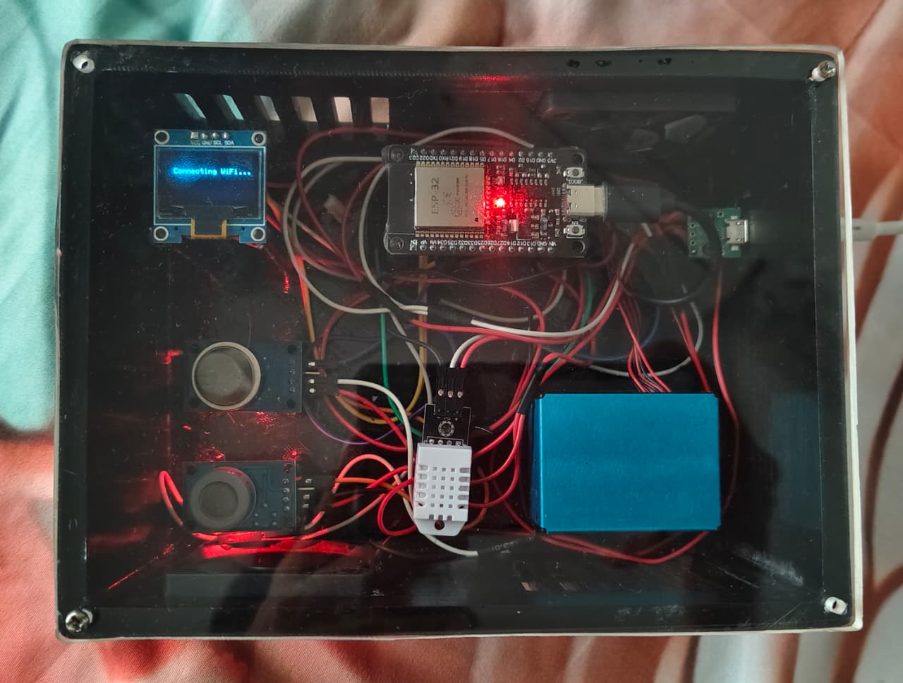

# IoT-Based Indoor Air Quality Monitoring System

### ESP32 • PMS5003 • MQ135 • MQ7 • DHT22 • Blynk Cloud • Twilio Alerts • Alexa Integration

---

## Overview

The **IoT-Based Indoor Air Quality Monitoring System** is a cloud-connected solution designed to measure and analyze critical indoor environmental parameters. It tracks temperature, humidity, carbon monoxide, harmful gases, and particulate matter using industry-grade sensors.

The ESP32 microcontroller uploads real-time data to the **Blynk Cloud**, enabling access through both **mobile** and **web dashboards**. The system also supports **Twilio alerts** for hazardous conditions and **Alexa integration** for voice-based monitoring.

This project demonstrates IoT, embedded systems, cloud integration, and real-time automation in a compact and user-friendly form.

---

## System Components

| Component                   | Description                                      |
| --------------------------- | ------------------------------------------------ |
| ESP32                       | Main microcontroller with Wi-Fi                  |
| DHT22                       | Temperature and humidity sensor                  |
| MQ7                         | Carbon monoxide (CO) sensor                      |
| MQ135                       | Gas sensor (CO2, NH3, NOx, benzene, smoke, etc.) |
| PMS5003                     | Laser-based dust sensor (PM1.0, PM2.5, PM10)     |
| SSD1306 OLED                | Local real-time data display                     |
| Blynk Cloud + Web Dashboard | Cloud visualization and alerts                   |
| Twilio API                  | SMS notifications                                |
| Alexa Skill                 | Voice-based air quality queries                  |

---

## Features

### Environmental Monitoring

* Real-time temperature and humidity
* CO measurement using MQ7
* Harmful gas detection using MQ135
* PM2.5 and PM10 dust measurement using PMS5003
* Automatic AQI categorization

### Cloud & Dashboards

* Blynk mobile dashboard
* Blynk web dashboard
* Cloud-based storage and trend graphs

### Alerts & Integrations

* Twilio SMS alerts on unsafe readings
* Alexa voice integration
* Automatic threshold-based warnings

### Hardware

* On-device OLED display
* Low-power ESP32 architecture

---

## System Architecture


---

## Use Case Diagram


---

## Activity Diagram


---

## Circuit Diagram


---

## Circuit Connections

| Component | ESP32 Pin  |
| --------- | ---------- |
| DHT22     | D5         |
| MQ7       | A0         |
| MQ135     | A1         |
| PMS5003   | UART RX/TX |
| OLED SDA  | D21        |
| OLED SCL  | D22        |

---

## Working Principle

1. ESP32 reads sensor data from DHT22, MQ7, MQ135, and PMS5003.
2. PM2.5/PM10 values and gas concentration are used to compute AQI.
3. OLED displays real-time sensor values.
4. ESP32 uploads the data to the **Blynk Cloud**.
5. Mobile and Web Dashboards display live values and graphs.
6. **Twilio** sends SMS alerts during critical conditions.
7. **Alexa Skill** provides voice responses such as:
   "Alexa, What's the Air Quality from Air Monitor."

---

Here is a **cleaner, neater, more professional** version without captions — only improved formatting and spacing:

---

## **Blynk Dashboards**

### **Mobile Dashboard**





---

### **Web Dashboard**





---

## **Hardware**

### **Air Monitor Device**



---

## Getting Started

### Prerequisites

Install the following Arduino IDE libraries:

* Blynk
* Adafruit GFX
* Adafruit SSD1306
* DHT Sensor Library
* PMS5003/PM Sensor Library
* WiFiManager
* ArduinoJson

---

## Installation & Setup

### 1. Clone the Repository

```
git clone https://github.com/yourusername/Air-Quality-Monitoring-System-IoT.git
```

### 2. Open the Project

Open the `.ino` file using Arduino IDE.

### 3. Add Your Credentials

```cpp
#define BLYNK_AUTH_TOKEN "YOUR_BLYNK_TOKEN"
#define WIFI_SSID        "YOUR_WIFI_NAME"
#define WIFI_PASS        "YOUR_WIFI_PASSWORD"
```

### 4. Select the Board

```
Tools → Board → ESP32 Dev Module
```

### 5. Upload the Code

Upload the firmware to the ESP32.

### 6. View Data on Blynk

Access through the Blynk app or web dashboard.

---

## Sample Output

```
Temperature: 27.8°C
Humidity: 62%
CO Level: 3.5 ppm
PM2.5: 22 µg/m³
PM10: 41 µg/m³
AQI: 75 (Moderate)
Status: Air quality is acceptable.
```

---

## Applications

* Smart home air quality monitoring
* Industrial workspace safety
* Educational IoT projects
* Research labs
* Real-time pollution analytics
* Health and safety automation

---

## Future Enhancements

* AI-based predictive AQI modeling
* MQTT-based multi-node monitoring network
* Integration with smart ventilation systems
* Battery-powered or solar-powered variant
* Advanced web-based analysis dashboard

---

## License

This project is licensed under the **MIT License**.
See the LICENSE file for more information.

---

## Contributors

- Adithyan TT
- Adithya Krishna
- Ashiq Thomas Ninan
- Anuraj Vijayan
- Ashish V Menon


---

## Useful Links

- [Blynk Platform](https://blynk.io)
- [Arduino IDE](https://www.arduino.cc/en/software)
- [ESP32 Documentation](https://docs.espressif.com/projects/esp-idf/en/latest/esp32/)
- [PMS5003 Datasheet](https://cdn-shop.adafruit.com/product-files/3686/PMS5003+Series+Data+Manua.pdf)
- [Twilio API Docs](https://www.twilio.com/docs/usage/api)
- [Alexa Skills Developer Console](https://developer.amazon.com/en-US/alexa/console/ask)


